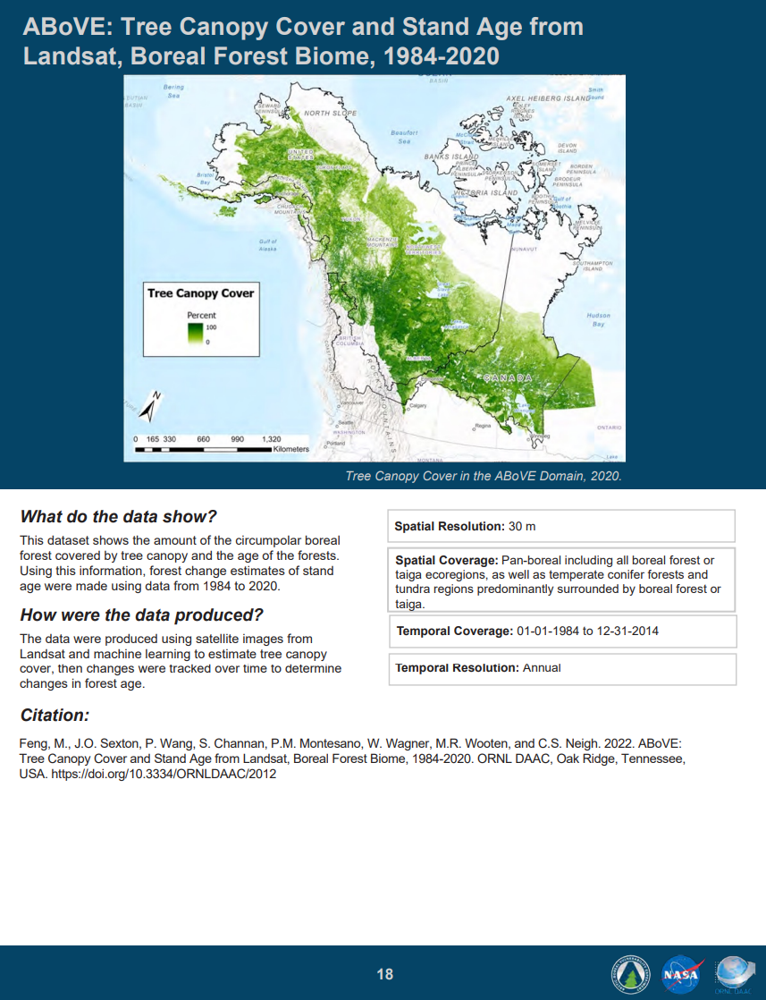

# Mary C. Banner  
Environmental GIS Analyst | Community-Centered Mapping | Earth Observation  

I am an Indigenous environmental scientist specializing in GIS and remote sensing, with a focus on translating complex environmental data into accessible tools that support community understanding and natural resource management. My work emphasizes spatial analysis, environmental change, and culturally relevant approaches to data and mapping.

---

## Featured Projects

### 🌎 NASA ABoVE Capstone – Communicating Complex Data Simply  
Developed GIS maps and regional booklet products using NASA NCCS climate and ecosystem datasets, translating Arctic-Boreal environmental data into accessible, community-centered visualizations for northern and Indigenous communities.
 

🔗 StoryMap: https://storymaps.arcgis.com/stories/3cc6651e268042efbd99c4128f274107  
🔗 GitHub: https://github.com/BanBan2488/ABoVE-plain-language-products  

---

### 🌿 Vieques Coastal Mapping (In Progress)  

Social network map developed in R to visualize relationships between environmental systems, stakeholders, and historical influences, including coral reefs, mangroves, U.S. Navy activity, and community-led decolonization efforts.

🔗 https://storymaps.arcgis.com/stories/b43f7a6bafdd402398e81dc8b8ceb431  

---

### 🌾 Effects of Anthropogenic Activities on Manoomin (Wild Rice)  
Performed GIS analysis to identify environmental impacts on wild rice ecosystems, highlighting spatial relationships affecting water quality, habitat health, and food sovereignty.

🔗 https://storymaps.arcgis.com/stories/49fdf986f15049d68111750f6b259499  

---

### 🧭 Indigenous Research Methodologies  
Applied Indigenous research frameworks alongside GIS tools to support community-centered environmental analysis and knowledge integration.

🔗 https://storymaps.arcgis.com/stories/39772728a6ad44bb803027b06f771729  

---

### 🐙 Phylum Cnidaria Project  
Used GIS to map and analyze marine species distribution and ecological patterns, integrating spatial data with biological concepts.

🔗 https://storymaps.arcgis.com/stories/c17829a472c249c8b869bc858d7a153a  

---

## Technical Skills

**GIS & Mapping:** ArcGIS Pro, ArcGIS Online, StoryMaps, Survey123, QGIS  
**Remote Sensing:** Landsat, Sentinel-2, Earth observation datasets  
**Programming & Analysis:** Python (ArcPy, Jupyter), R  
**Data & Spatial Analysis:** Raster and vector workflows, spatial analysis, NetCDF processing  
**Data Sources:** NASA Earthdata, Oak Ridge National Laboratory Distributed Active Archive Center (ORNL DAAC), USGS, NOAA  

---

## Current Focus

- Building GIS workflows that support environmental and community-based applications  
- Developing accessible mapping products for natural resource and climate data  
- Expanding skills in Python and geospatial data analysis  

---

## Contact

- LinkedIn: https://linkedin.com/in/chefmaryb88  
- GitHub: https://github.com/BanBan2488 
- Resume: [Download Resume](Resume/Mary_Banner_Resume.pdf) 